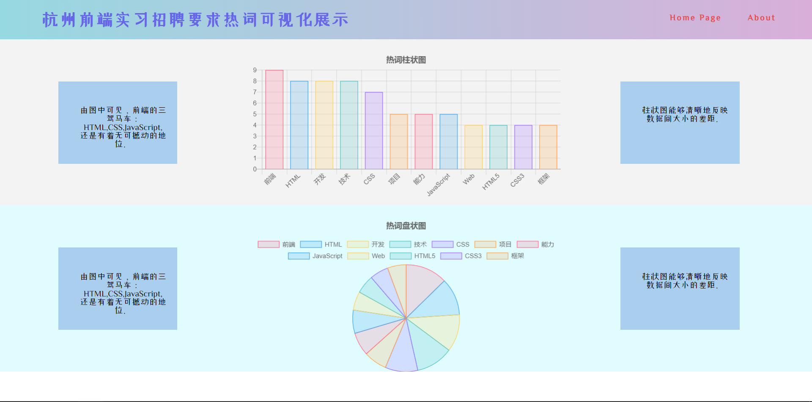

# Hot-Words

### This website show you the hottest words in job market nowadays about front-end internship job.

- Use python crawler to get data from one of the largest job-hutting website [Boss 直聘](https://www.zhipin.com/)

- Use Chart.js to visualize data.

- Use React to build the whole website.

Run:

`npm install`

`npm start`

Todo:

1. Make it responsive.

2. Design a better look.
